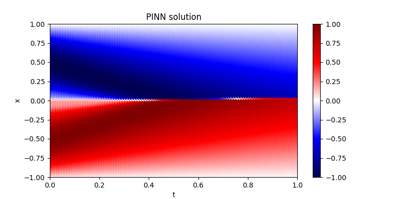

# Burgers equation

Implements [PINN(s)](https://doi.org/10.1016/j.jcp.2018.10.045) in PyTorch to solve Burgers equation. 

## Solution
The following is the PINN-derived solution under a specific initial and boundary conditions (IC: sine wave, BC: zero Dirichlet). 

